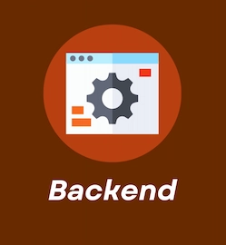

# 100 Days of Code 2025

1. **[Frontend🔻](#1-frontend)**
2. **[Backend🔻](#2-backend)**  

---

## 1. FRONTEND:  

  

### Index:  

1. **[HTML & CSS🔻](./docs/HTML-CSS.md)**
2. **[Version Control - Git & GitHub🔻](./docs/GIT-GITHIB.md)**

 

**[Return to Top 🔝](#100-days-of-code-2025)**

---

## 2. BACKEND:  

  

### Index:  

1. **[Coming Soon🔻]()**
2. **[Coming Soon🔻]()**

 

**[Return to Top 🔝](#100-days-of-code-2025)**

---