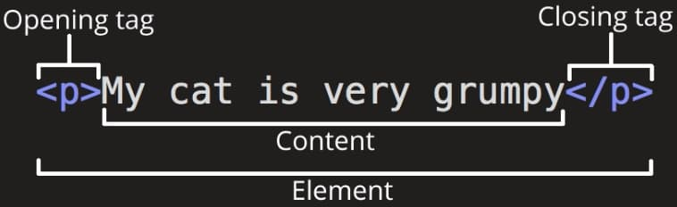
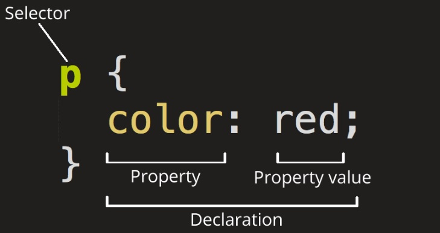

# 100 Days of Code 2025

## Index:

### HTML & CSS 
1. **[Anatomy of an HTML element 👇](#anatomy-of-an-html-element)**
2. **[Anatomy of an CSS Ruleset/Rule 👇](#anatomy-of-a-css-ruleset)**

 

---

## Anatomy of an HTML element

  
**Element Name: `paragraph element`**

 

**[Return to Top 👆](#100-days-of-code-2025)**  

---

## Anatomy of a CSS ruleset

  

 

**[Return to Top 👆](#100-days-of-code-2025)**  

---
