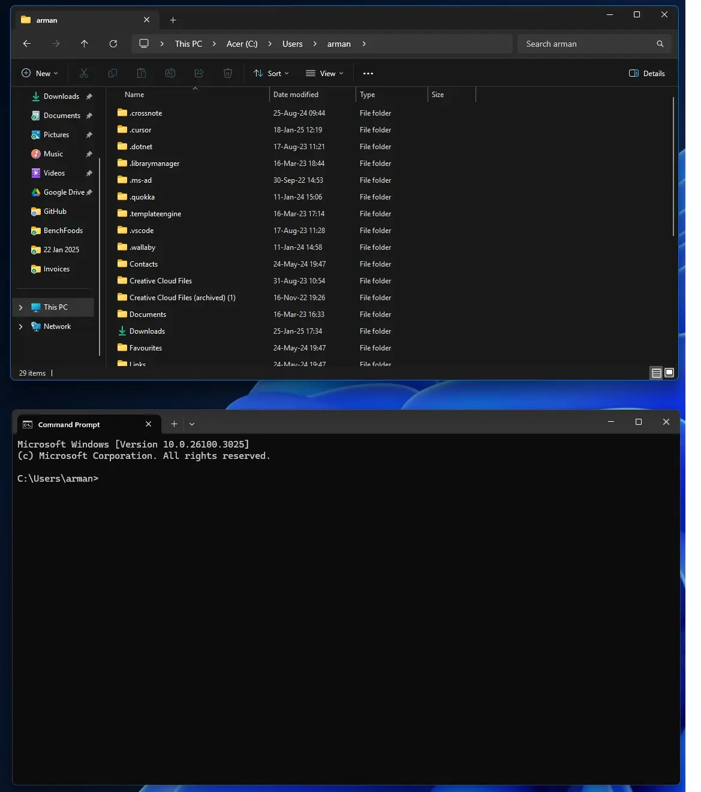

# Version Control - Git & GitHub

## Index:

## Git:

1. **[Windows Command Prompt - Commands🔻](#windows-command-prompt---commands)**

## GitHub:

1. **[GitHub - Anatomy of an HTML element🔻](#anatomy-of-an-html-element)**


<br />

---

## Windows Command Prompt - Commands

### GUI and CLI

- **GUI** - Graphical User Interface - top window
  - **File Explorer** - file manager
- **CLI** - Command Line Interface - bottom window
  - **Command Prompt** - command line interface

  

### See what is inside a folder

```cmd
dir
```


<br />

**[Return to Top 🔝](#version-control---git--github)**

---
