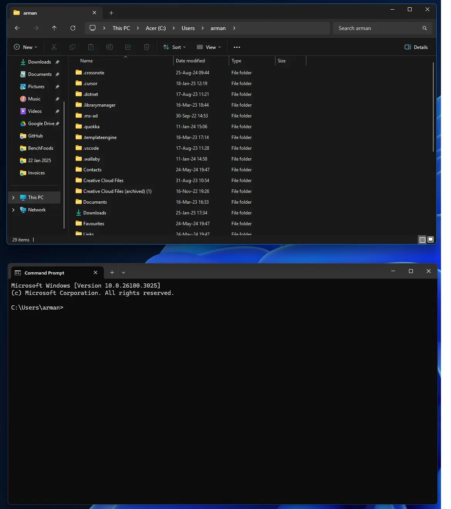
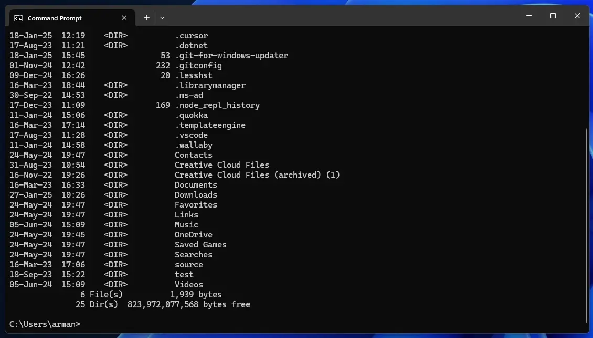
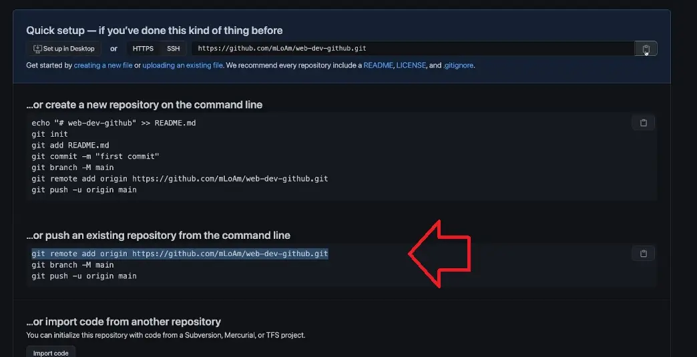

# Version Control - Git & GitHub

## Index:

## Git:

1. **[Windows Command Prompt - Commands🔻](#windows-command-prompt---commands)**
2. **[Git - Commands🔻](#git---commands)**
3. **[Git - Branches🔻](#git---branches)**
4. **[Git - Delete Branches🔻](#git---delete-branches)**  

## GitHub:

1. **[GitHub - Adding files to GitHub🔻](#github---adding-files-to-github)**
2. **[GitHub - Nothing on computer, get from GitHub🔻](#github---nothing-on-computer-get-from-github)**
3. **[GitHub - Collaboration on Projects with other developers🔻](#github---collaboration-on-projects-with-other-developers)**


<br />

---

## Windows Command Prompt - Commands

### GUI and CLI

- **GUI** - Graphical User Interface - top window
  - **File Explorer** - file manager
- **CLI** - Command Line Interface - bottom window
  - **Command Prompt** - command line interface

  

### 1. See what is inside a folder

```cmd
dir
```    

 

### 2. One folder up

```cmd
cd ..
```   

### 3. Move into another drive

```cmd
D:
```    

### 4. Go from `C:\Users>` go to arman

***Below is relative paths***

```cmd
cd arman
```  

**Go to desktop from `C:\Users\arman>`**

```cmd
cd OneDrive\Desktop
```  

***Below is absolute paths (What developers use)***

```cmd
cd C:\Users\arman\OneDrive\Desktop
```  

**To go to C:\Users**

```cmd
cd C:\Users\
```   

### 5. Go to root directory

```cmd
cd /
```  

### 6. Clear the screen

```cmd
cls
```  

### 7. Create a new folder

```cmd
mkdir new-folder
```  

### 8. Create a new file with content of "Hello, Armand"

```cmd
echo "Hello, Armand" > new-file.txt
```  

### 9. To read the file content

```cmd
type new-file.txt
``` 

### 10. Delete a file

```cmd
del new-file.txt
``` 

### 11. Delete a folder

```cmd
rmdir new-folder
``` 

### 12. Delete a folder and all files inside it

```cmd
rmdir /s new-folder
``` 


<br />

**[Return to Top 🔝](#version-control---git--github)**

---

## Git - Commands


***See what git version is installed***

```bash
git --version
```    

***Initialize a git repository***

- ***A brand new folder open in vs code, open terminal and run:***

```bash
git init
```    

- ***See if project is now being run by git:***

```bash
git status
```    

- ***Add a file that should be tracked by git:***

```bash
git add index.html
```    

**Credentials check / update (Optional)**

- ***Get/check the user name and email:***

```bash
git config --global user.name
git config --global user.email
``` 

- ***Update the user name and email:***

```bash
git config --global user.name "Armand"
git config --global user.email "armand@example.com"
``` 

- ***See what files need to be committed:***

```bash
git status
``` 

- ***Displays the commit history of a Git repository:***

```bash
git log
``` 

- ***Exit commit history:***

```bash
q
``` 

- ***Commit the file to the repository:***

```bash
git commit -m "Initial commit"
``` 

<br />

**[Return to Top 🔝](#version-control---git--github)**

---

### Git - Branches

- ***See current branch:***

```bash
git branch
```  

- ***See all branches:***

```bash
git branch -a
```  

- ***Rename the current branch to `main`:***

```bash
git branch -m main
```  

- ***Create and switch to a new branch:***

```bash
git checkout -b new-branch
``` 

- ***Stage and commit changes in the new branch:***

```bash
git add index.html
git commit -m "Add index.html to new-branch"
```

- ***Merge changes from one branch into another:***

1. Switch to the main branch

```bash
git checkout main
```  

2. Merge the new branch into the main branch

```bash
git merge new-branch
```  


<br />

**[Return to Top 🔝](#version-control---git--github)**

---

### Git - Delete Branches

- ***Delete a file in a branch:***

```bash
git rm file-name
```  

- ***Restore deleted file in branch:***

`HEAD~1` means "go back one commit from the current commit (HEAD)" in your Git history. 

```bash
git reset --hard HEAD~1
```  

- ***Delete a branch:***

```bash
git branch -D branch-name
```  


<br />

**[Return to Top 🔝](#version-control---git--github)**

---

## GitHub - Adding files to GitHub  

***After steps above, you can add files to GitHub***

  


<br />

**[Return to Top 🔝](#version-control---git--github)**


---

## GitHub - Nothing on computer, get from GitHub  

**Copy repository from GitHub to local computer**

 

1. Open empty named folder in vs code
2. Open terminal in vs code
3. Run `git clone https://github.com/username/repository.git` .
4. Using the URL of the repository and a space followed by ` .`, it downloads the repository's contents directly into the current folder, without creating a new subfolder.
5. Created a new file/folder locally in the cloned repository and want to commit it to GitHub?

```bash
git add .
git commit -m "Added local text file after clone"
git push origin main
```

<br />

**[Return to Top 🔝](#version-control---git--github)**


---

## GitHub - Collaboration on Projects with other developers  

1. Accept invitation to collaborate on a project
2. Clone the repository to your local computer
3. Make changes to the code
4. Commit the changes to your branch
5. Push your changes to GitHub
6. Create a pull request to merge your changes into the main branch


<br />

**[Return to Top 🔝](#version-control---git--github)**


---