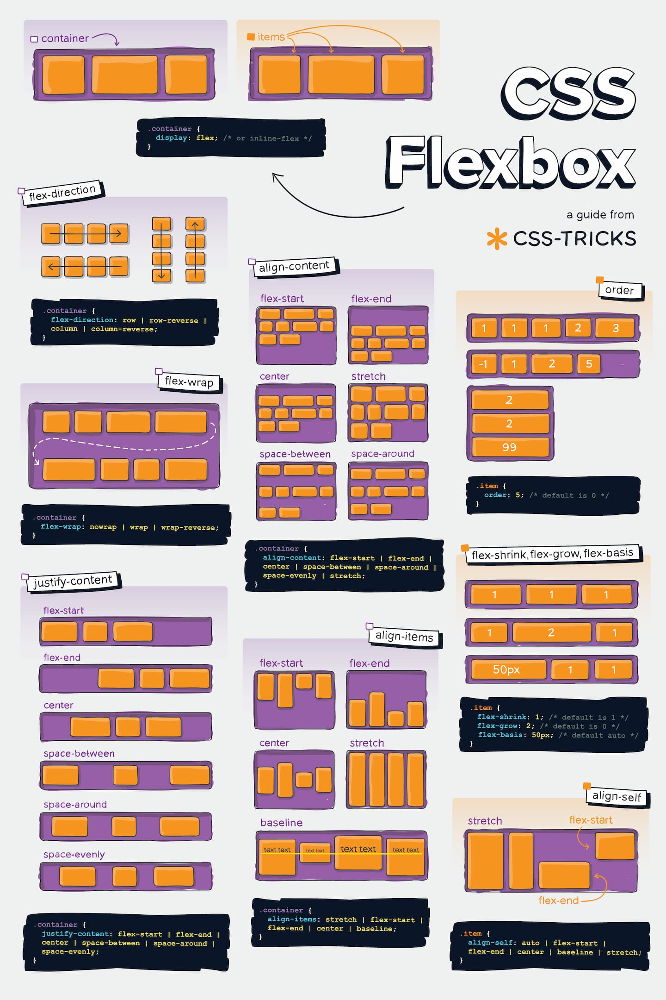
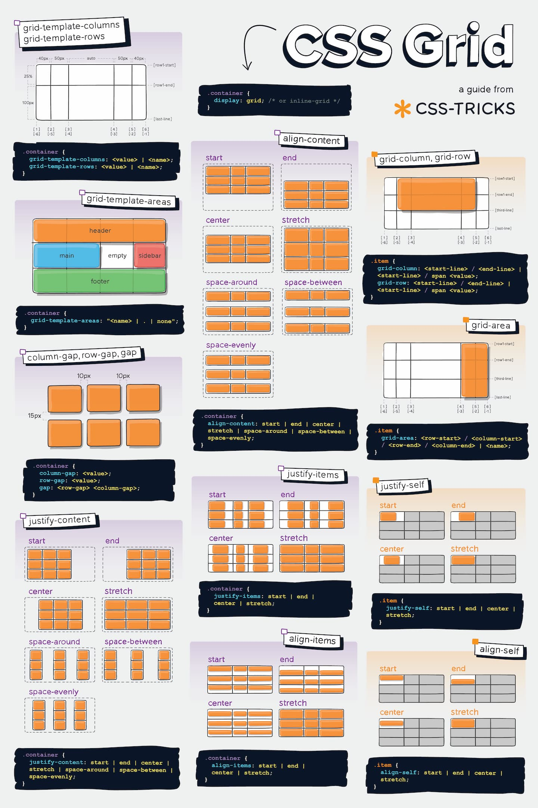
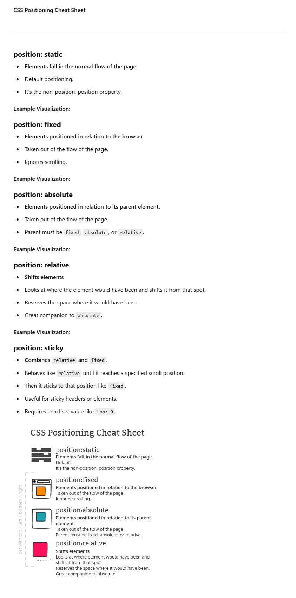

# HTML & CSS - Layout and Positioning  

---  

## 📌 Index:    

1. **[⚠️ Flex🔻](#flex)**  
2. **[⚠️ Grid🔻](#grid)**  
3. **[⚠️ Positioning🔻](#positioning)**  
4. **[⚠️ Responsive Design🔻](#responsive-design)**  

---  

## Flex  

> [!NOTE]
> **Flexbox Overview:**  
> - Ideal for one-dimensional layouts (either rows or columns).  
> - **Key Properties:** `justify-content`, `align-items`, `flex-direction`.  
> - **Tip:** For `flex-wrap` to work, the container or its children must have a size constraint.  
> - **Additional Tips:**  
>   - Use the shorthand `flex` property to set `flex-grow`, `flex-shrink`, and `flex-basis`.  
>   - The `order` property can rearrange items without changing the HTML structure.

**[🔝 Back to Top](#html--css---layout-and-positioning)**

---  

## Grid  

> [!NOTE]
> **CSS Grid Overview:**  
> - Best suited for two-dimensional layouts (rows and columns).  
> - **Key Properties:** `grid-template-columns`, `grid-template-rows`, and `gap` (or `grid-gap`).  
> - **Tip:** Ensure the grid container has defined columns or rows for proper layout rendering.  
> - **Additional Tips:**  
>   - Use `grid-template-areas` to create named areas for more semantic and flexible layouts.  
>   - Leverage functions like `minmax()`, `auto-fit`, or `auto-fill` to create responsive grid tracks.

**[🔝 Back to Top](#html--css---layout-and-positioning)**

---  

## Positioning  

> [!NOTE]
> **Positioning Essentials:**  
> - **Types:** `static` (default), `relative`, `absolute`, `fixed`, and `sticky`.  
> - **Document Flow:**  
>   - `relative` elements remain in the normal flow.  
>   - `absolute` and `fixed` elements are removed from the document flow.  
>   - `sticky` acts like a relative element until a defined scroll threshold is met, then behaves like fixed.  
> - **Tip:** Use `z-index` to manage stacking order when elements overlap.  
> - **Additional Tips:**  
>   - `fixed` positions elements relative to the viewport, while `absolute` positions them relative to the nearest positioned ancestor.  
>   - Ensure that a parent element has a non-static position if you intend an absolutely positioned child to be contained within it.

**[🔝 Back to Top](#html--css---layout-and-positioning)**

---  

## Responsive Design

> [!NOTE]
> **Responsive Design Tips:**  
> - Use media queries to adjust layouts and element sizing for different screen sizes.  
> - Combine Flexbox or Grid with breakpoints to create adaptive designs.  
> - **Additional Tips:**  
>   - Use relative units (%, em, rem, vw, vh) instead of fixed units to enhance scalability.  
>   - Consider a mobile-first approach and tools like CSS `clamp()` for fluid typography and spacing.

**[🔝 Back to Top](#html--css---layout-and-positioning)**

---
