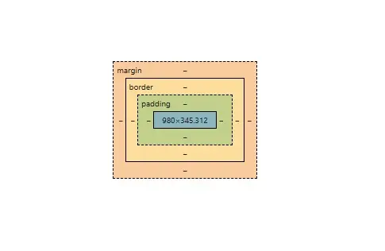

# 100 Days of Code 2025

## Index:

## HTML & CSS:

1. **[HTML - Anatomy of an HTML element🔻](#anatomy-of-an-html-element)**
2. **[CSS - Anatomy of an CSS Ruleset/Rule🔻](#anatomy-of-a-css-ruleset)**
3. **[CSS - Inline, Internal, External🔻](#css---inline-internal-external)**
4. **[CSS - ⚠️ CORRECT ORDER for Pseudo-classes for `<a>` (anchor tags) & `<button>` (buttons)🔻](#correct-order-for-pseudo-classes-for-a-anchor-tags--button-buttons)**  

## HTML & CSS Deep Dive:  
5. **[CSS - Remove list styles, e.g. circle, squares, numbers, etc.🔻](#remove-list-styles-eg-circle-squares-numbers-etc)**
6. **[CSS - Box Model - ⚠️ Box Sizing - NB. border-box🔻](#box-model---box-sizing)**  
7. **[CSS - ⚠️ Different VALUES AND SHORTHANDS for PADDING and MARGIN🔻](#different-values-and-shorthands-for-padding-and-margin)**  
8. **[CSS - ⚠️ Margin COLLAPSE🔻](#margin-collapse)**  
9. **[CSS - Centering an Element🔻](#centering-an-element)** 
10. **[HTML - ⚠️ Semantic HTML🔻](#semantic-html)**
11. **[CSS - ⚠️ Selectors and Combinators🔻](#css-selectors-and-combinators)**
12. **[HTML - 📅 Dates `<time>`🔻](#html-dates-time)**
13. **[CSS - 🎁 Box Shadows🔻](#css-box-shadows)**
14. **[HTML - 📄 Download Links🔻](#html-download-links)**
15. **[HTML - 🥇 Perfect `<head>` Section🔻](#html-perfect-head-section)**
16. **[HTML - 🥇 Perfect 📂 Folder and 🗃️ File Structure🔻](#html-perfect-folder-and-file-structure)**
17. **[CSS - 🖼️ BACKGROUND Image🔻](#css---background-image)**
18. **[CSS - 🖼️ Image to cover the `` element🔻](#css---image-to-cover-the-img-element)**
19. **[CSS - 🏳️‍🌈 Giving a background a LINEAR GRADIENT🔻](#css---giving-a-background-a-linear-gradient)**

 

<br />

---

## Anatomy of an HTML element

  
**Element Name: `paragraph element`**

<br />

**[Return to Top 🔝](#100-days-of-code-2025)**

---

## Anatomy of a CSS ruleset

  
**CSS Ruleset/Rule**

<br />

**[Return to Top 🔝](#100-days-of-code-2025)**

---

## CSS - Inline, Internal, External

## Inline Styling

```html
<!-- Using inline CSS via the style attribute -->
<h1 style="font-family: sans-serif; text-align: center; color: rgb(83, 75, 75);">
  Arri's Challenge for Monday, January 20th, 2025
</h1>
```

## Internal Styling

```html
<head>
  <!-- Using internal CSS -->
  <style>
    p {
      font-family: sans-serif;
      text-align: center;
      color: rgb(83, 75, 75);
    }
  </style>
</head>
```

## External Styling  

> [!TIP] 
> **"Separation of Concerns" (SoC) - Separate HTML, CSS, and JavaScript into different files.**  

<br />

```html
<head>
  <!-- Using external CSS -->
  <link rel="stylesheet" href="styles.css" />
</head>
```

<br />

**[Return to Top 🔝](#100-days-of-code-2025)**

---

## Correct order for Pseudo-classes for `<a>` (anchor tags) & `<button>` (buttons)

### Anchor Tags:  

> [!IMPORTANT] 
> **Remember: `LoVe HAte Focus D` (Link → Visited → Hover → Active → Focus → Disabled)!!**  

<br />

```html
<a href="https://developer.mozilla.org/en-US/" target="_blank" rel="noopener noreferrer">more learning resources</a>
```

```css
a {
  color: rgb(167, 1, 78);
  text-decoration: none;
  transition: all 300ms ease-in-out; /* Increased for smoother transitions */
}

/* 1. :link Pseudo-class - unvisited links */
a:link {
  color: rgb(167, 1, 78);
}

/* 2. :visited Pseudo-class - visited links */
a:visited {
  color: purple;
}

/* 3. :hover Pseudo-class - mouse over links */
a:hover {
  text-decoration: underline;
}

/* 4. :active Pseudo-class - clicked/active links */
a:active {
  color: red;
}

/* 5. :focus Pseudo-class - keyboard navigation */
a:focus {
  outline: 2px solid rgb(167, 1, 78);
  outline-offset: 2px;
}

/* 6. :focus-visible Pseudo-class - enhanced keyboard focus */
a:focus-visible {
  outline: 2px solid rgb(167, 1, 78);
  outline-offset: 2px;
}

/* 7. :disabled Pseudo-class - disabled state */
a:disabled {
  color: #cccccc;
  cursor: not-allowed;
  opacity: 0.7;
}
```

### Buttons:  

> [!IMPORTANT]  
> **Remember: `HAF D` (Hover → Active → Focus → Disabled)!!**

<br />

```css
button {
  background: #007bff;
  color: white;
  padding: 10px 20px;
  border: none;
  border-radius: 4px;
  cursor: pointer;
  transition: all 300ms ease-in-out;
}

/* 1. :hover Pseudo-class - mouse over buttons */
button:hover {
  background: #0056b3;
}

/* 2. :active Pseudo-class - clicked/pressed buttons */
button:active {
  transform: scale(0.98);
}

/* 3. :focus Pseudo-class - keyboard navigation */
button:focus {
  outline: 2px solid #0056b3;
  outline-offset: 2px;
}

/* 4. :focus-visible Pseudo-class - enhanced keyboard focus */
button:focus-visible {
  outline: 2px solid #0056b3;
  outline-offset: 2px;
}

/* 5. :disabled Pseudo-class - disabled state */
button:disabled {
  background: #cccccc;
  cursor: not-allowed;
  opacity: 0.7;
}
```

<br />

**[Return to Top 🔝](#100-days-of-code-2025)**

---

## Remove list styles, e.g. circle, squares, numbers, etc.   


```css
/* INHERITANCE: On the parent element, can style the li's individually later on if needed. */
ol {
  list-style: none;
}
```

<br />

**[Return to Top 🔝](#100-days-of-code-2025)**

---

## Box Model - Box Sizing   


```css
/* Ensures padding and border are included in the total width and height. The default is content-box. */
* {
  box-sizing: border-box;
}
```

  

<br />

**[Return to Top 🔝](#100-days-of-code-2025)**

---


## Different values and shorthands for PADDING and MARGIN  


```css
BUTTON {
  /* 1. Horizontal refers to the main-axis (x-axis), affecting the left and right sides. */
  /* 2. Vertical refers to the cross-axis (y-axis), affecting the top and bottom sides. */

  /* -------------------------------------------------------------------------- */

  /* Four values: Top (y-axis) | Right (x-axis) | Bottom (y-axis) | Left (x-axis) */
  padding: 5px 10px 20px 12px;

  /* Three values: Top (y-axis) | Horizontal (x-axis: Right & Left) | Bottom (y-axis) */
  padding: 5px 10px 20px;

  /* Two values: Vertical (y-axis: Top & Bottom) | Horizontal (x-axis: Right & Left) */
  padding: 5px 10px;

  /* One value: All sides (y-axis and x-axis) */
  padding: 5px;

  /* ⚠️ MARGIN ONLY ⚠️ - x-axis: Centres the element horizontally on the main axis */
  margin: auto;

  /* ⚠️ MARGIN ONLY ⚠️ - Combination of absolute and auto values */
  /* Top (y-axis): 10px */
  /* Horizontal (x-axis: Right & Left): auto (centres horizontally) */
  /* Bottom (y-axis): 20px */
  margin: 10px auto 20px;
}
```


<br />

**[Return to Top 🔝](#100-days-of-code-2025)**

---

## Margin COLLAPSE  

> [!IMPORTANT]
> **Margin collapse occurs when two vertical margins (top/bottom) meet. Instead of adding up, the larger margin "wins".**

```css
/* Basic Example */
.box-1 {
  margin-bottom: 20px;
}

.box-2 {
  margin-top: 30px;
}

/* The space between box-1 and box-2 will be 30px (not 50px) */

/* Common ways to prevent margin collapse: */
.box-1 {
  /* Method 1: Add a border */
  border-bottom: 1px solid transparent;
  
  /* Method 2: Add padding */
  padding-bottom: 1px;
  
  /* 
    EASIEST: Method 3: BFC (Block Formatting Context): 
    - A BFC is a region in a webpage that creates its own independent formatting environment   
      that follows its own rules and is isolated from outside elements. 
    - This method is the EASIEST and most RELIABLE way to prevent margin collapse.
  */
  display: flex;
  /* or */
  overflow: hidden;
}
```


<br />

**[Return to Top 🔝](#100-days-of-code-2025)**

---

## Centering an Element  


```css
ol {
  /* Horizontal Margin: auto (centres the element horizontally) */
  /* Top | Right (auto) | Bottom | Left (auto) */
  margin: 36px auto 0 auto;
}
```


<br />

**[Return to Top 🔝](#100-days-of-code-2025)**

---

## Semantic HTML  


```html
<!doctype html>
<html lang="en-US">
  <head>
    <meta charset="utf-8" />
    <meta name="viewport" content="width=device-width" />

    <title>Web Development Guide | Learn HTML & CSS</title>
    <link
      href="https://fonts.googleapis.com/css?family=Open+Sans+Condensed:300|Sonsie+One"
      rel="stylesheet" />
    <link rel="stylesheet" href="style.css" />
  </head>

  <body>
    <!-- Header contains the main branding and top-level site information -->
    <header>
      <h1>Modern Web Development</h1>
    </header>

    <!-- Nav element represents the main navigation menu -->
    <nav>
      <ul>
        <li><a href="#">Getting Started</a></li>
        <li><a href="#">HTML Basics</a></li>
        <li><a href="#">CSS Tutorials</a></li>
        <li><a href="#">Resources</a></li>
      </ul>

      <!-- A Search form: another common non-linear way to navigate through a site. -->
      <form>
        <input type="search" name="q" placeholder="Search tutorials..." />
        <input type="submit" value="Search" />
      </form>
    </nav>

    <!-- Main element contains the primary content of the page -->
    <main>
      <!-- Article represents a self-contained composition (like a blog post or news story) -->
      <article>
        <h2>Introduction to Semantic HTML</h2>

        <p>
          Semantic HTML is the foundation of modern web development. By using the
          right HTML elements, we create websites that are both accessible and
          SEO-friendly. This guide will help you understand how to structure your
          web pages effectively using semantic elements like header, nav, main,
          article, and footer.
        </p>

        <section>
          <h3>Understanding Document Structure</h3>

          <p>
            A well-structured HTML document helps both users and search engines
            navigate your content. Each semantic element serves a specific purpose,
            making your code more meaningful and easier to maintain.
          </p>

          <p>
            For example, the header element typically contains your site's branding
            and main navigation, while the main element wraps around your page's
            primary content. This clear structure improves accessibility and helps
            screen readers better interpret your content.
          </p>
        </section>

        <section>
          <h3>Writing Clean, Accessible Code</h3>

          <p>
            Accessibility should never be an afterthought. By using semantic HTML
            elements correctly, you're already taking important steps toward making
            your website accessible to all users, including those using screen
            readers or keyboard navigation.
          </p>

          <p>
            Remember to include proper ARIA labels where needed, use meaningful alt
            text for images, and maintain a logical heading structure. These
            practices ensure your website can be used by everyone, regardless of
            how they access the web.
          </p>
        </section>
      </article>

      <!-- Aside contains content that is related but not essential to the main content -->
      <aside>
        <h2>Recommended Reading</h2>

        <ul>
          <li><a href="#">Getting Started with HTML5</a></li>
          <li><a href="#">CSS Best Practices Guide</a></li>
          <li><a href="#">Web Accessibility Fundamentals</a></li>
          <li><a href="#">Responsive Design Basics</a></li>
          <li><a href="#">SEO for Web Developers</a></li>
        </ul>
      </aside>
    </main>

    <!-- Footer contains site-wide information like copyright, contact info, etc. -->
    <footer>
      <p>©Copyright 2024 Web Development Guide. All rights reserved.</p>
    </footer>
  </body>
</html>
```


<br />

**[Return to Top 🔝](#100-days-of-code-2025)**


---

## CSS Selectors and Combinators  

### Key Selectors

```css
/* 1. Basic Selectors - Target elements directly */
#id { }                 /* ID selector [0,1,0,0] (avoid for styling) */
.class { }              /* Class selector [0,0,1,0] */
p { }                   /* Element selector [0,0,0,1] */
* { }                   /* Universal selector [0,0,0,0] */

/* 2. Attribute Selectors - Target elements by their attributes */
[disabled] { }          /* Has attribute [0,0,1,0] */
[type="text"] { }       /* Exact match [0,0,1,0] */
[class*="btn-"] { }     /* Contains [0,0,1,0] */
[href^="https"] { }     /* Starts with [0,0,1,0] */
[src$=".pdf"] { }       /* Ends with [0,0,1,0] */

/* 3. Combinators - Define relationships between elements */
article p { }           /* Descendant: any p inside article [0,0,0,2] */
article > p { }         /* Child: direct p only [0,0,0,2] */
h2 + p { }             /* Adjacent: p right after h2 [0,0,0,2] */
h2 ~ p { }             /* Sibling: any p after h2 [0,0,0,2] */

/* 4. Pseudo-classes - Target special states */

/* Links: Remember "LoVe HAte Focus D" order! */
a:link { }             /* 1. Unvisited links [0,0,1,1] */
a:visited { }          /* 2. Visited links [0,0,1,1] */
a:hover { }            /* 3. Mouse over [0,0,1,1] */
a:active { }           /* 4. During click [0,0,1,1] */
a:focus { }            /* 5. Keyboard navigation [0,0,1,1] */
a:disabled { }         /* 6. Disabled state [0,0,1,1] */

/* Buttons: Remember "HAF D" order! */
button:hover { }       /* Mouse over [0,0,1,1] */
button:active { }      /* During click [0,0,1,1] */
button:focus { }       /* Keyboard focus [0,0,1,1] */
button:disabled { }    /* Disabled state [0,0,1,1] */

/* Form States */
input:checked { }      /* Checked inputs [0,0,1,1] */
input:valid { }        /* Valid inputs [0,0,1,1] */
input:invalid { }      /* Invalid inputs [0,0,1,1] */

/* Position-based */
li:first-child { }     /* First element [0,0,1,1] */
li:last-child { }      /* Last element [0,0,1,1] */
li:nth-child(2n) { }   /* Even elements [0,0,1,1] */

/* 5. Pseudo-elements - Style specific parts of elements */
p::first-letter { }    /* First letter [0,0,0,2] */
p::first-line { }      /* First line [0,0,0,2] */
p::selection { }       /* Selected text [0,0,0,1] */
::placeholder { }      /* Input placeholder [0,0,0,1] */

/* Content insertion */
.quote::before {       /* Before element [0,0,1,1] */
    content: "❝";
}
.quote::after {        /* After element [0,0,1,1] */
    content: "❞";
}
```

> [!IMPORTANT]
> **Remember these orders:**
> - Links: **LoVe HAte** (Link, Visited, Hover, Active)
> - Buttons: **HAF D** (Hover, Active, Focus, Disabled)

<br />

**[Return to Top 🔝](#100-days-of-code-2025)**

---

## HTML Dates `<time>`


```html
<h2>
  <time datetime="2025-01-23">Thursday, January 23rd, 2025</time>
</h2>
```

<br />

**[Return to Top 🔝](#100-days-of-code-2025)**

---

## CSS Box Shadows


```css
li {
  /* 
    1. 1px: horizontal offset - x-axis (a positive value moves the shadow to the RIGHT)
    2. 1px: vertical offset - y-axis (a positive value moves the shadow DOWN)
    3. 4px: blur radius
    4. rgba(0,0,0,0.2): black shadow color at 20% opacity 
  */
  box-shadow: 1px 1px 4px rgba(0, 0, 0, 0.2);
}
```

<br />

**[Return to Top 🔝](#100-days-of-code-2025)**

---

## HTML Download Links

> [!TIP]
> **Adding rel="noopener noreferrer" is recommended when using target="_blank". It improves security and performance.It’s still a good habit even for internal resources.**  


```html
<!-- Use the "download" attribute to allow users to download the file -->
<a href="assets/documents/html-css-basics-summary.pdf" target="_blank" rel="noopener noreferrer">Download PDF Summary</a>
```

<br />

**[Return to Top 🔝](#100-days-of-code-2025)**

---

## HTML Perfect `<head>` Section   


```html
<!DOCTYPE html>
<html lang="en">
  <head>
    <!-- Declare the document type as HTML5 -->
    <meta charset="UTF-8" />
    
    <!-- Set the viewport for responsive design -->
    <meta name="viewport" content="width=device-width, initial-scale=1.0" />

    <!-- Page title: Aim for 50-60 characters for SEO -->
    <title>Descriptive Page Title</title>

    <!-- Meta description: Ideal length is 150-160 characters -->
    <meta name="description" content="Brief and engaging description of the page content to improve SEO and click-through rates." />

    <!-- Language settings for accessibility -->
    <meta http-equiv="Content-Language" content="en" />

    <!-- Specify the page author -->
    <meta name="author" content="Your Name or Company" />

    <!-- Control search engine indexing (index and follow links on this page) -->
    <meta name="robots" content="index, follow" />

    <!-- Improve performance by preconnecting to required resources -->
    <link rel="preconnect" href="https://fonts.googleapis.com" />
    <link rel="preconnect" href="https://fonts.gstatic.com" crossorigin />

    <!-- Link to the external CSS stylesheet -->
    <link rel="stylesheet" href="css/styles.css" />

    <!-- Favicon for browser tabs -->
    <link rel="icon" href="images/favicon.ico" />

    <!-- Add a manifest file if building a Progressive Web App (PWA) -->
    <link rel="manifest" href="manifest.json" />
    <!-- Sets the browser toolbar color on some mobile browsers -->
    <meta name="theme-color" content="#ffffff" />

    <!-- Open Graph (OG) meta tags for social media sharing -->
    <!-- Title: Ideal length is 50-60 characters -->
    <meta property="og:title" content="Descriptive Page Title for Sharing" />
    <!-- Description: Optimal length is 150-200 characters -->
    <meta property="og:description" content="An engaging and descriptive summary of your page content to encourage clicks from social media." />
    <!-- Image: Provide a high-resolution image (recommended size: 1200x630px) -->
    <meta property="og:image" content="https://www.example.com/images/og-image.jpg" />
    <!-- URL: Specify the canonical URL of the shared page -->
    <meta property="og:url" content="https://www.example.com/page-url" />
    <!-- Type: Define the type of content (e.g., website, article, video) -->
    <meta property="og:type" content="website" />

    <!-- Twitter Card meta tags for better presentation on Twitter -->
    <meta name="twitter:card" content="summary_large_image" />
    <!-- Title: Ideal length is 50-70 characters -->
    <meta name="twitter:title" content="Engaging Page Title for Twitter" />
    <!-- Description: Optimal length is 120-150 characters -->
    <meta name="twitter:description" content="A short and compelling description to encourage engagement on Twitter." />
    <!-- Image: Recommended image size is 1200x675px -->
    <meta name="twitter:image" content="https://www.example.com/images/twitter-image.jpg" />
    <!-- Specify the site username (if applicable) -->
    <meta name="twitter:site" content="@YourTwitterHandle" />

    <!-- Load external JavaScript for interactivity -->
    <!-- Place JavaScript files at the end of <body> for faster page rendering -->
  </head>
  <body>
    <!-- Main page content goes here -->

    <!-- Load external JavaScript before the closing body tag -->
    <script src="js/scripts.js"></script>
  </body>
</html>
```

<br />

**[Return to Top 🔝](#100-days-of-code-2025)**

---


## HTML Perfect Folder and File Structure   


```bash
project-root/
├── index.html
├── about.html
├── contact.html
├── assets/
│   ├── css/
│   │   ├── styles.css
│   │   ├── reset.css
│   │   └── components/
│   │       ├── header.css
│   │       ├── footer.css
│   │       ├── buttons.css
│   │       └── forms.css
│   ├── js/
│   │   ├── scripts.js
│   │   └── modules/
│   │       ├── slider.js
│   │       ├── form-validation.js
│   │       ├── navigation.js
│   │       └── analytics.js
│   ├── images/
│   │   ├── favicon/                 # Store your favicon(s) here
│   │   │   └── favicon.ico
│   │   ├── icons/                   # Shared icons (social media, etc.)
│   │   │   ├── facebook-icon.png
│   │   │   ├── twitter-icon.png
│   │   │   └── instagram-icon.png
│   │   ├── shared/                  # Common images used on multiple pages
│   │   │   ├── logo.png
│   │   │   └── banner.jpg
│   │   └── about/                   # Page-specific images for "about" page (example)
│   │       ├── about-team.jpg
│   │       └── about-office.jpg
│   ├── fonts/
│   │   └── custom-font.woff2
│   └── data/
│       ├── products.json
│       └── user-data.json
├── docs/
│   └── project-manual.pdf
├── tests/
│   ├── unit/
│   │   └── example-test.js
│   └── e2e/
│       └── example-test.spec.js
└── README.md
```  


<br />

**[Return to Top 🔝](#100-days-of-code-2025)**

---


## CSS - Background Image   


```css
#hero {
  height: 800px;
  background-image: url(../images/places/ocean.webp);
  background-position: center;
  background-size: cover;
}
```  


<br />

**[Return to Top 🔝](#100-days-of-code-2025)**

---


## CSS - Image to cover the `` element   


```css
.destination img {
  height: 200px;
  width: 100%;
  /* Images covers the space perfectly */
  object-fit: cover;
}
```  


<br />

**[Return to Top 🔝](#100-days-of-code-2025)**

---


## CSS - Giving a background a LINEAR GRADIENT   


```css
#highlights {
  /* Angle in degrees, 1st color, second color */
  background: linear-gradient(0deg, rgb(227, 255, 253), rgb(210, 245, 250));
}
```  


<br />

**[Return to Top 🔝](#100-days-of-code-2025)**

---