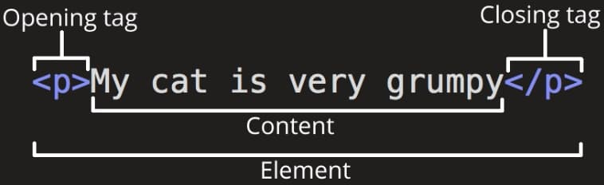

# 100 Days of Code 2025

## Index:

## HTML & CSS:

1. **[HTML - Anatomy of an HTML element 🔻](#anatomy-of-an-html-element)**
2. **[CSS - Anatomy of an CSS Ruleset/Rule 🔻](#anatomy-of-a-css-ruleset)**
3. **[CSS - Inline, Internal, External 🔻](#css---inline-internal-external)**
4. **[CSS - ⚠️ CORRECT ORDER for Pseudo-classes for `<a>` (anchor tags) & `<button>` (buttons) 🔻](#correct-order-for-pseudo-classes-for-a-anchor-tags--button-buttons)**  

## HTML & CSS Deep Dive:  
5. **[CSS - Remove list styles, e.g. circle, squares, numbers, etc. 🔻](#remove-list-styles-eg-circle-squares-numbers-etc)**
6. **[CSS - Box Model - ⚠️ Box Sizing 🔻](#box-model---box-sizing)**  
7. **[CSS - ⚠️ Different VALUES AND SHORTHANDS for PADDING and MARGIN 🔻](#different-values-and-shorthands-for-padding-and-margin)**  
8. **[CSS - ⚠️ Margin COLLAPSE 🔻](#margin-collapse)**  
9. **[CSS - Centering an Element 🔻](#centering-an-element)**  


<br />

---

## Anatomy of an HTML element

  
**Element Name: `paragraph element`**

<br />

**[Return to Top 🔝](#100-days-of-code-2025)**

---

## Anatomy of a CSS ruleset


<br />

**[Return to Top 🔝](#100-days-of-code-2025)**

---

## CSS - Inline, Internal, External

## Inline Styling

```html
<!-- Using inline CSS via the style attribute -->
<h1 style="font-family: sans-serif; text-align: center; color: rgb(83, 75, 75);">
  Arri's Challenge for Monday, January 20th, 2025
</h1>
```

## Internal Styling

```html
<head>
  <!-- Using internal CSS -->
  <style>
    p {
      font-family: sans-serif;
      text-align: center;
      color: rgb(83, 75, 75);
    }
  </style>
</head>
```

## External Styling  

> [!TIP] 
> **"Separation of Concerns" (SoC) - Separate HTML, CSS, and JavaScript into different files.**  

<br />

```html
<head>
  <!-- Using external CSS -->
  <link rel="stylesheet" href="styles.css" />
</head>
```

<br />

**[Return to Top 🔝](#100-days-of-code-2025)**

---

## Correct order for Pseudo-classes for `<a>` (anchor tags) & `<button>` (buttons)

### Anchor Tags:  

> [!IMPORTANT] 
> **Remember: `LoVe HAte Focus D` (Link → Visited → Hover → Active → Focus → Disabled)!!**  

<br />

```html
<a href="https://developer.mozilla.org/en-US/" target="_blank" rel="noopener noreferrer">more learning resources</a>
```

```css
a {
  color: rgb(167, 1, 78);
  text-decoration: none;
  transition: all 300ms ease-in-out; /* Increased for smoother transitions */
}

/* 1. :link Pseudo-class - unvisited links */
a:link {
  color: rgb(167, 1, 78);
}

/* 2. :visited Pseudo-class - visited links */
a:visited {
  color: purple;
}

/* 3. :hover Pseudo-class - mouse over links */
a:hover {
  text-decoration: underline;
}

/* 4. :active Pseudo-class - clicked/active links */
a:active {
  color: red;
}

/* 5. :focus Pseudo-class - keyboard navigation */
a:focus {
  outline: 2px solid rgb(167, 1, 78);
  outline-offset: 2px;
}

/* 6. :focus-visible Pseudo-class - enhanced keyboard focus */
a:focus-visible {
  outline: 2px solid rgb(167, 1, 78);
  outline-offset: 2px;
}

/* 7. :disabled Pseudo-class - disabled state */
a:disabled {
  color: #cccccc;
  cursor: not-allowed;
  opacity: 0.7;
}
```

### Buttons:  

> [!IMPORTANT]  
> **Remember: `HAF D` (Hover → Active → Focus → Disabled)!!**

<br />

```css
button {
  background: #007bff;
  color: white;
  padding: 10px 20px;
  border: none;
  border-radius: 4px;
  cursor: pointer;
  transition: all 300ms ease-in-out;
}

/* 1. :hover Pseudo-class - mouse over buttons */
button:hover {
  background: #0056b3;
}

/* 2. :active Pseudo-class - clicked/pressed buttons */
button:active {
  transform: scale(0.98);
}

/* 3. :focus Pseudo-class - keyboard navigation */
button:focus {
  outline: 2px solid #0056b3;
  outline-offset: 2px;
}

/* 4. :focus-visible Pseudo-class - enhanced keyboard focus */
button:focus-visible {
  outline: 2px solid #0056b3;
  outline-offset: 2px;
}

/* 5. :disabled Pseudo-class - disabled state */
button:disabled {
  background: #cccccc;
  cursor: not-allowed;
  opacity: 0.7;
}
```

<br />

**[Return to Top 🔝](#100-days-of-code-2025)**

---

## Remove list styles, e.g. circle, squares, numbers, etc.   


```css
/* INHERITANCE: On the parent element, can style the li's individually later on if needed. */
ol {
  list-style: none;
}
```

<br />

**[Return to Top 🔝](#100-days-of-code-2025)**

---

## Box Model - Box Sizing   


```css
/* Ensures padding and border are included in the total width and height. The default is content-box. */
* {
  box-sizing: border-box;
}
```

  

<br />

**[Return to Top 🔝](#100-days-of-code-2025)**

---


## Different values and shorthands for PADDING and MARGIN  


```css
BUTTON {
  /* 1. Horizontal refers to the main-axis (x-axis), affecting the left and right sides. */
  /* 2. Vertical refers to the cross-axis (y-axis), affecting the top and bottom sides. */

  /* -------------------------------------------------------------------------- */

  /* Four values: Top (y-axis) | Right (x-axis) | Bottom (y-axis) | Left (x-axis) */
  padding: 5px 10px 20px 12px;

  /* Three values: Top (y-axis) | Horizontal (x-axis: Right & Left) | Bottom (y-axis) */
  padding: 5px 10px 20px;

  /* Two values: Vertical (y-axis: Top & Bottom) | Horizontal (x-axis: Right & Left) */
  padding: 5px 10px;

  /* One value: All sides (y-axis and x-axis) */
  padding: 5px;

  /* ⚠️ MARGIN ONLY ⚠️ - x-axis: Centres the element horizontally on the main axis */
  margin: auto;

  /* ⚠️ MARGIN ONLY ⚠️ - Combination of absolute and auto values */
  /* Top (y-axis): 10px */
  /* Horizontal (x-axis: Right & Left): auto (centres horizontally) */
  /* Bottom (y-axis): 20px */
  margin: 10px auto 20px;
}
```


<br />

**[Return to Top 🔝](#100-days-of-code-2025)**

---

## Margin COLLAPSE  

> [!IMPORTANT]
> **Margin collapse occurs when two vertical margins (top/bottom) meet. Instead of adding up, the larger margin "wins".**

```css
/* Basic Example */
.box-1 {
  margin-bottom: 20px;
}

.box-2 {
  margin-top: 30px;
}

/* The space between box-1 and box-2 will be 30px (not 50px) */

/* Common ways to prevent margin collapse: */
.box-1 {
  /* Method 1: Add a border */
  border-bottom: 1px solid transparent;
  
  /* Method 2: Add padding */
  padding-bottom: 1px;
  
  /* 
    EASIEST: Method 3: BFC (Block Formatting Context): 
    - A BFC is a region in a webpage that creates its own independent formatting environment   
      that follows its own rules and is isolated from outside elements. 
    - This method is the EASIEST and most RELIABLE way to prevent margin collapse.
  */
  display: flex;
  /* or */
  overflow: hidden;
}
```


<br />

**[Return to Top 🔝](#100-days-of-code-2025)**

---

## Centering an Element  


```css
ol {
  /* Horizontal Margin: auto (centres the element horizontally) */
  margin: 36px auto 0 auto;
}
```


<br />

**[Return to Top 🔝](#100-days-of-code-2025)**

---